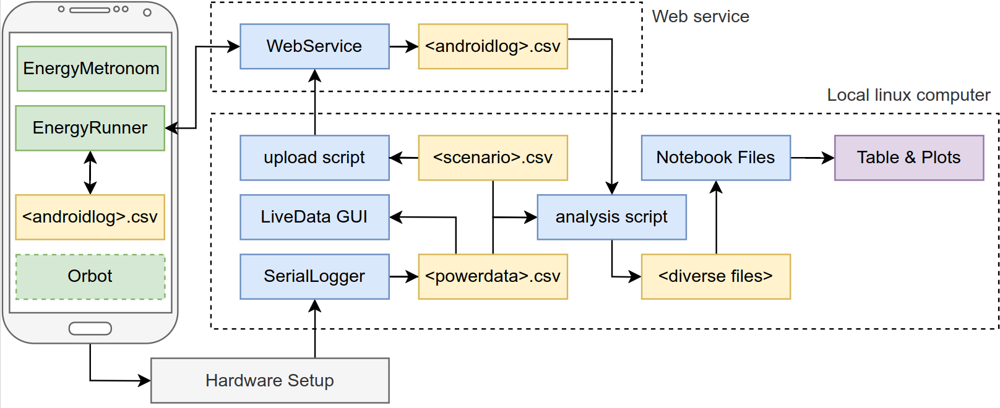

# Powering Privacy

This repository contains the artifacts from the paper: [Powering Privacy: On the Energy Demand and Feasibility of Anonymity Networks on Smartphones](https://www.usenix.org/conference/usenixsecurity23/).
It is has been submitted to the Artifact Evaluation process and has been awarded all badges we applied for.
You can find the [artifact appendix here](https://www.usenix.org/system/files/usenixsecurity23-appendix-hugenroth.pdf).

## Overview

This repository contains:
- Documentation to build a hardware measurement kit
- Software and instructions to perform macro studies of long-running protocols
- Software and instructions to perform micro studies of individual operations
- Software and instructions to analyze results from these studies and generate plots
- Sample traces to allow evaluation without having to build the hardware kit

To verify these claims for the artifact evaluation process, please follow the [walkthrough.md](walkthrough.md) file.

## Requirements

You need access to a local computer running Ubuntu 20.04 with at least 16GiB of RAM and 200GiB of free disk space.
For the hardware setup, see the [bill of materials](hardware/bill-of-materials.md).

Further, we assume that you are comfortable doing the following tasks:
- Usage of standard developer tools (git, ssh, etc.)
- Basic familiarity with Python 3, Jupyter Notebooks, Android, and Rust
- Creating and running Docker images

We tested the setup with the following software:
- Ubuntu 20.04.6 LTS ([download here](https://releases.ubuntu.com/focal/))
- Python 3.8.10 (installed via apt-get)
- Docker 24.0.4 ([downloaded from here](https://docs.docker.com/engine/install/ubuntu/#install-using-the-convenience-script))
- Rust rustc 1.71.0-stable ([downloaded from here](https://rustup.rs/))
- Android Studio 2022.1.1 ([downloaded from here](https://developer.android.com/studio/archive))
- Gradle wrapper version 7.5 (installed with the tools within the `android` folder)

## Architecture overview

The following diagram shows the architecture of all components.
Note that for many of the steps, you do not need all of them.
The arrows indicate the direction of data flow, not necessarily the order of execution.

The central component of the architecture is the hardware measurement kit.
This is described in [hardware/README.md](hardware/README.md) which contains both assembly and usage instructions.
The measurement kit is placed between the smartphone and the power supply and records the current and voltage over time.

The data is collected on the computer using the [rsoxy serial logger](rsoxy/README.md).
This Rust program reads the custom protocol via a serial connection of USB and stores it in a CSV file in the `/measurements` folder.

At any time the [LiveLogger](livelogger/README.md) can be used to view the so-far recorded power consumption.

## Macro studies

Macro studies measure the power consumption of a protocol over a long period of time.
For this the protocol is started manually on the smartphone, the display is turned off, and then `rsoxy` is started.
The recording is finished by terminating `rsoxy`.

Afterwards the `.csv` data can be analysed using any tool of your choice.
For example, using a Jupyter Notebook as shown in [notebooks/jupyter_tor.ipynb](notebooks/jupyter_tor.ipynb).

## Micro studies

Micro studies measure the power consumption of single operations.
For this, you first create a scenario file such as those in the [scenarios](scenarios) folder.

Then you upload the scenario to the [web service](webservice/README.md) using the [upload-scenarios.sh](scripts/README.md) script.
On the smartphone we use the [EnergyRunner](android/README.md) app to download the scenario.
A USB-to-go adapter and a USB-serial-adapter are used to connect the smartphone to the measurement kit to synchronize their clocks.
This process is described in the [walkthrough.md](walkthrough.md) document.

After the scenario has finished, the serial logger is terminated and on the Android phone the local logs (that contain the timings of individual operations) are uploaded to the web service.
The [analyze.py](scripts/README.md) script can then be used to download the logs, compare them to the local recordings, and break them into the individual sections for the operations.
The resulting `.csv` files can then be analysed using any tool of your choice.
For example, using a Jupyter Notebook as shown in [notebooks/jupyter_crypto_sections.ipynb](notebooks/jupyter_crypto_sections.ipynb).
