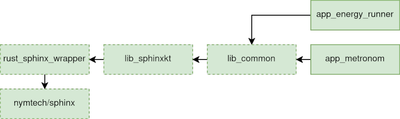
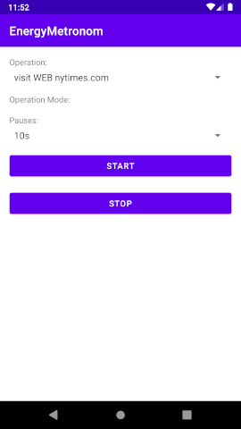
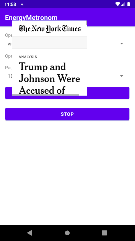
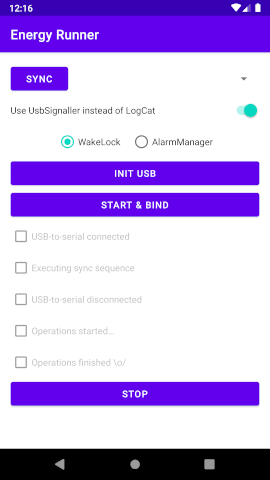

# Android

This folder contains all Android related project code including libraries and apps.

It consists of two library modules and two app modules.
The `lib_sphinxkt` is a wrapper around the Rust [Sphinx library](https://github.com/nymtech/sphinx).
The `lib_common` library implements many operations used by both apps and depends on the `lib_sphinxkt` library.
The `app_metronom` app allows to execute operations at regular intervals (e.g. opening a web page every 60 seconds).
This is used e.g. for the Tor and VPN macro studies.
The `app_energy_runner` allows to run scenarios files.
These are downloaded from the [web service](../web_service/README.md) and then executed.
This app also synchronizes with the data logger using USB serial and can later upload the timing information for the individual operations.




## Setup and build

Install Android Studio 2022.2.1 (or newer) and open the project.

The `lib_sphinxkt` uses the Mozilla "Rust Android Gradle Plugin" to build and link the Rust code.
Follow their [setup instruction](https://github.com/mozilla/rust-android-gradle#usage) to setup all dependencies.
You might find that it helpful to first try your local Rust setup with the simpler [rsoxy serial logger project](../rsoxy/README.md).

Once you opened the project and installed the Rust Android plugin dependencies, you can build the project (Build > Make Project).

Alternatively, you can build the project from the command line:

```
$ ./gradlew assembleDebug
```

## Run

You can install the `app_metronom` using the following command:

```
./gradlew app_metronom:installDebug
```

After install find the app in the launcher drawer and drag it to the start screen.
Go to the Android app info (usually long press on the icon), navigate to "Advanced" and enable "Display over other apps".
This is required to show the overlay window for the web browsing task.
One starting the app you should see a screen like the following below.
Select a short pause, click `Start`, and observe after 60 seconds that an overlay window appears that loads a website and closes on finish.

 

You can install the `app_energy_runner` using the following command:

```
./gradlew app_energy_runner:installDebug
```

After install find the app in the launcher drawer and drag it to the start screen.
Go to the Android app info (usually long press on the icon) and deactivate any battery optimization that might interfere with running the app in the background for long periods of time.
One starting the app you should see a screen like the following below.
The details on how to use the app are given in the complete AE run-through instructions.



## Docker

There is no Dockerfile for this component, as there is no reliable image for Android development that includes Rust components.
