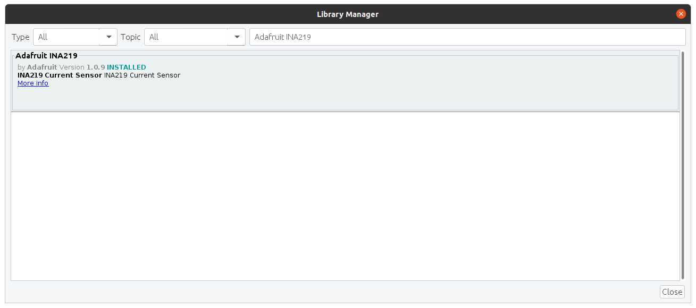

# Arduino

This folder contains the software and instruction to flash the Arduino for the hardware setup.


## Setup and build

Install the Arduino IDE. Then install the Adafruit INA219 library by going to `Tools > Manage Libraries` and searching for `Adafruit INA219`:



Then open the `logger.ino` file in the Arduino IDE and flash it to the Arduino. Follow the instructions for the other hardware setup in [hardware/README.md](../hardware/README.md).

Alternatively, you can use the `arduino-cli` to build and flash the Arduino:

```bash
$ export FQDN="arduino:megaavr:nona4809"
$ arduino-cli board list
$ arduino-cli compile --fqbn $FQDN logger
$ arduino-cli upload -p /dev/ttyACM0 --fqbn $FQDN logger
```


## Run

When all components have been connected, you can start the Arduino by connecting it to a free USB port on your computer.
Use the [rsoxy](../rsoxy/README.md) serial logger to verify that everything is working correctly.
In particular, watch out for messages that indicate that the INA219 was not found.
The Arduino should reset every time the serial connection is re-started which allows to just restart the serial logger without having to re-connect the Arduino.


## Optional: custom INA219 calibration

By default the `logger.ino` uses a 16V/400mA calibration for the INA219.
However, 400mA might be limiting, and we can increase the range to 800mA as well as increasing the sampling frequency by modifying the library.

To do so, find the libraries folder of the Arduino IDE, open the file `libraries/Adafruit_INA219/Adafruit_INA219.cpp`, and add the following lines below the other `setCalibration_` functions:

```cpp
void Adafruit_INA219::setCalibration_CUSTOM() {
  // 16V & 800mA
  ina219_currentDivider_mA = 20;
  ina219_powerMultiplier_mW = 1.0f;

  ina219_calValue = 8192;
  Adafruit_BusIO_Register calibration_reg =
      Adafruit_BusIO_Register(i2c_dev, INA219_REG_CALIBRATION, 2, MSBFIRST);
  calibration_reg.write(ina219_calValue, 2);

  uint16_t config = INA219_CONFIG_BVOLTAGERANGE_16V |
                    INA219_CONFIG_GAIN_2_80MV |
                    INA219_CONFIG_BADCRES_11BIT |
                    INA219_CONFIG_SADCRES_11BIT_1S_276US |
                    INA219_CONFIG_MODE_SANDBVOLT_CONTINUOUS;

  Adafruit_BusIO_Register config_reg =
      Adafruit_BusIO_Register(i2c_dev, INA219_REG_CONFIG, 2, MSBFIRST);
  config_reg.write(config, 2);
}
```

Also add `void setCalibration_CUSTOM();` to `libraries/Adafruit_INA219/Adafruit_INA219.h`.
Then uncomment the relevant line (l. 53) in `logger.ino`, comment the other old calibration, and flash the Arduino again.