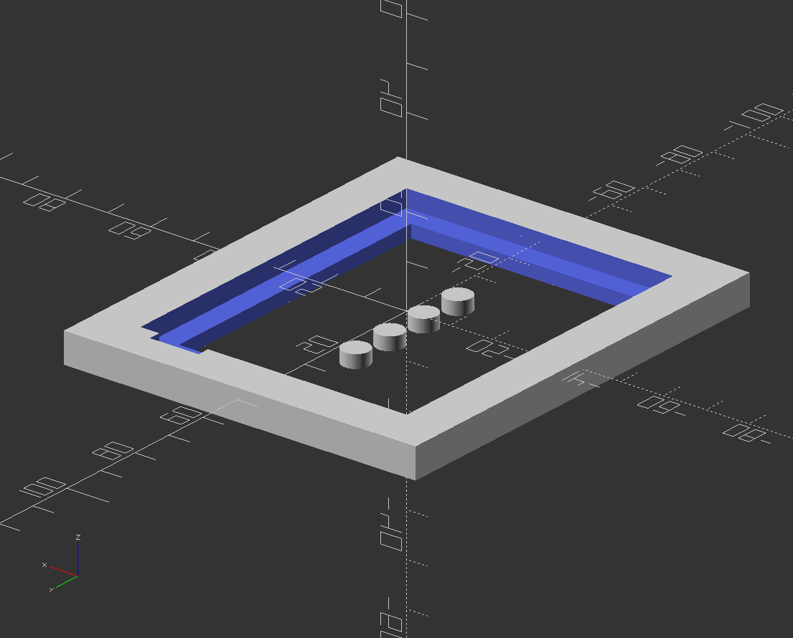

# 3D Printed Parts

Both hardware parts are designed using [OpenSCAD](https://openscad.org/) and maintained within the respective `.scad` files.
From these the STL files are rendered.
You should use the slicing tool that is recommended for your 3D printer to generate the respective `.gcode` files.
For reference, the folder contains some for the Pruse i3 MK3S.

## Renderings

This is the **battery replacement** which goes into the phone. Note the corners that allow it to snap into place. Also, there are three cut-outs for the contacts.

This is the **battery holder** which holds and connects the actual battery. Note the hole (front left) where the battery connector slides in.

