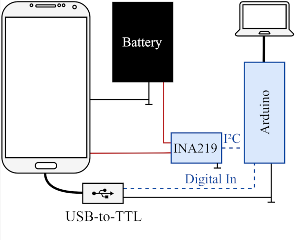
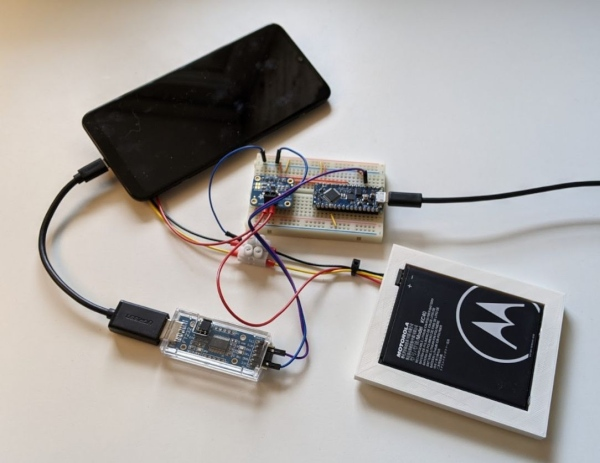
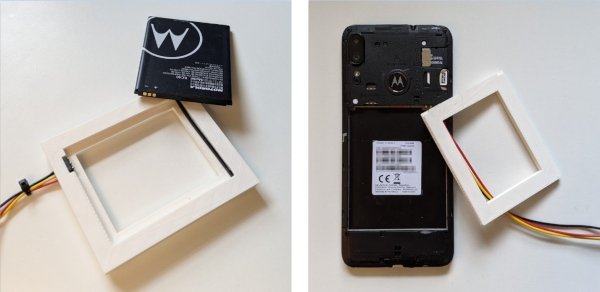

# Hardware

This directory contains all hardware-related files and documentation.

## Overview

The following schematic shows the overall setup. A power sensor (INA219) is placed between smartphone and battery to record the current power consumption. These results are read by an Arduino using the I2C protocol and the logged over USB to a computer. Optionally, a USB-to-go adapter and USB-to-serial component can be used to connect the smartphone to the Arduino to synchronize their clocks for the micro studies.

The following pictures show the full setup in the real world.

## Setup & Build

For building the hardware kit start by reading both the [Bill of Material](bill-of-materials.md) and the [Build Instructions](build-instructions.md) completely.

## Usage

Follow the instructions in the [walkthrough](../walkthrough.md) file to learn how to use this kit.
