# Build instructions

## Step 1: breadboard assembly (1 hour)

**Required tools:** Soldering station, wire cutter, wire stripper

**Required skills:** Soldering, working with breadboards

**Required material:** Arduino Nano Every, INA219, Breadboard, 6.8kΩ resistor, Breadboard wires

First, follow the instructions for the Arduino and INA219 components to finish their break out assembly. Typically, this involves soldering the header pins to the components. 

Then, connect the components on the breadboard as shown in the following image:

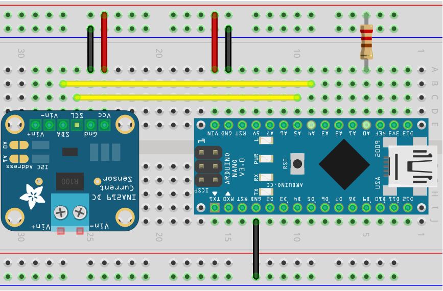

Note that the resistor is 6.8kΩ, and not as shown in the picture 220Ω. Your Arduino and INA219 breakout boards might look differently.

You can now test this setup using the instructions in the [Arduino section](../arduino/README.md). Together with the [rsoxy](../rsoxy/README.md) serial logger, you should be able to see measurements of ~0mW.

## Step 2: 3D print components (4 hours)

**Required tools:** 3D printer, slicer software

**Required skills:** 3D printing

**Required material:** 3D printing material

Use the files and instruction in the [3D parts](../3d-parts/README.md) section to print the required components. You should end up with the following parts:

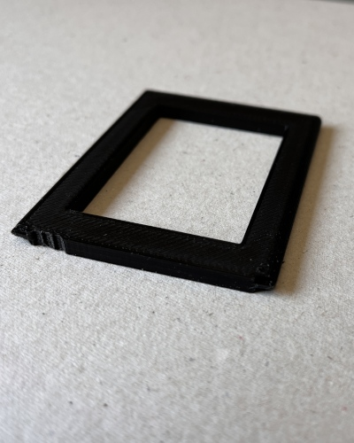 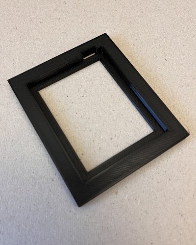 

## Step 3: battery holder assembly (2 hours + 24 hours for epoxy to cure)

**Required tools:** Soldering station, wire cutter, wire stripper, crimping tool

**Required skills:** Working with two-part epoxy, soldering

**Required material:** Leaf battery connectors, two-part epoxy, gloves, wires

Insert the leaf battery connector component into the respective cut-out of the battery holder. Be careful when inserting it and push in the connectors with a screwdriver or similar tool. While there should be some resistance, if the component does not fit use a file or similar to remove excessive material from the 3D printed part. Once inserted, the component should look like this:

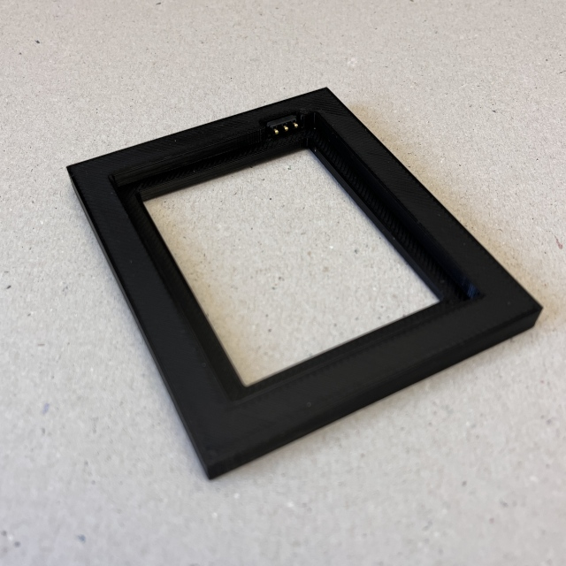

Flip the component and solder the wires to the leaf battery connector. Make the black (ground) and yellow (data) wires about 8cm long. Make the red (positive) wire about 15cm long so that it can be later connected to the INA219 screw terminal. Use the crimp tools to add ferrules to the wires. The component should look like this:

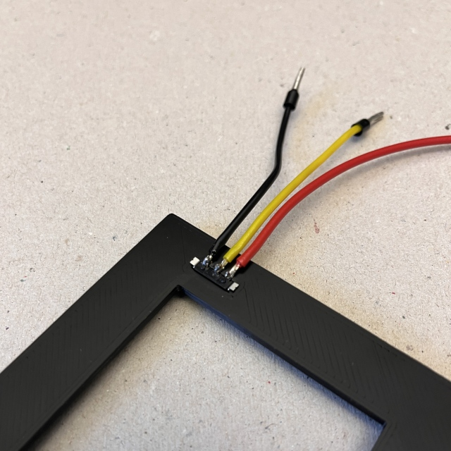

Now, use the two-part epoxy to glue the leaf battery connector to the battery holder. Use some additional epoxy on top of the wires to give them extra support. Also glue the small "feets" to the bottom of the battery holder. The final component should look like this:

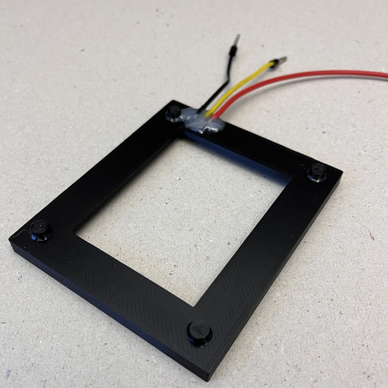

Let the epoxy cure for 12 hours.

Insert a battery into the component and check that the connections align well. Use a digital multimeter to measure the voltage between the red and black wires. It should be around 3.8V. If not, check the connections and the battery. 

## Step 4: battery inlet assembly (2 hours + 24 hours for epoxy to cure)

**Required tools:** Soldering station, wire cutter, wire stripper, crimping tool, tweezers

**Required skills:** Working with two-part epoxy, soldering, working with small parts

**Required material:** SD card adapter, two-part epoxy, gloves, wires

Inspect the 3D printed battery inlet and identify the spaces for the contacts. If necessary, use a file to ensure that the corners are free of excessive material and that the surface is smooth.

Break the SD card adapter open and remove the contacts. Use the tweezers and wire cutter to remove individual contacts from it. You will need at least three. Use the 3D printed part and the tweezers to bend them so that their front is flush with the cut-outs of the 3D printed part and their end lies on the back of the component. Once all components are "harvested" and bent, apply a small amount of two-part epoxy for each contact and carefully insert them into space using a tweezer. The following pictures illustrate the process:

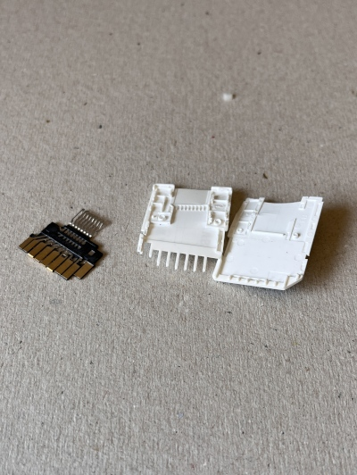
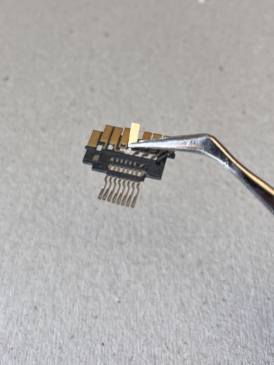
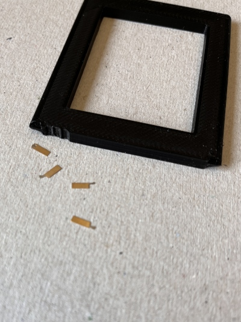
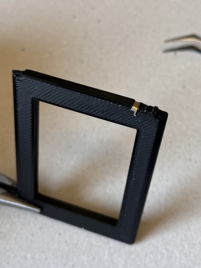
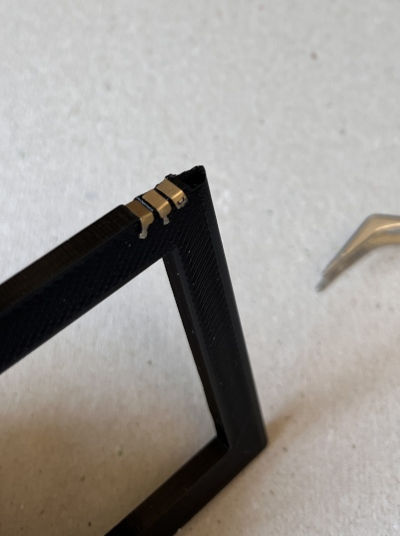

Be careful for the first 5 minutes while the epoxy hardens. Then wait another 12 hours for the epoxy to cure completely.

Now, solder the wires to the contacts. Make the black (ground) and yellow (data) wires about 10cm long. Make the red (positive) wire about 20cm long so that it can be later connected to the INA219 screw terminal. Use the crimp tools to add ferrules to the wires. The component should look like this:

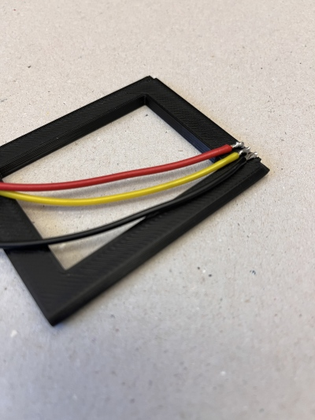

Then add some epoxy to the wires to give them extra support. The component should look like this:

Let the epoxy cure for 12 hours.

Once everything is cured, insert a battery into the component and check that the connections align well. Alternatively, you can insert it into the battery holder and check good connectivity between the wire pairs of the same color.

## Step 5: final assembly (1 hour)

**Required tools:** Screw drivers

**Required material:** Terminal connector block

Use the terminal connector block to directly connect the black (ground) and yellow (data) wires of the battery inlet and the battery holder.
Connect the red (positive) wires to the screw terminal of the INA219. The final assembly should look like this:

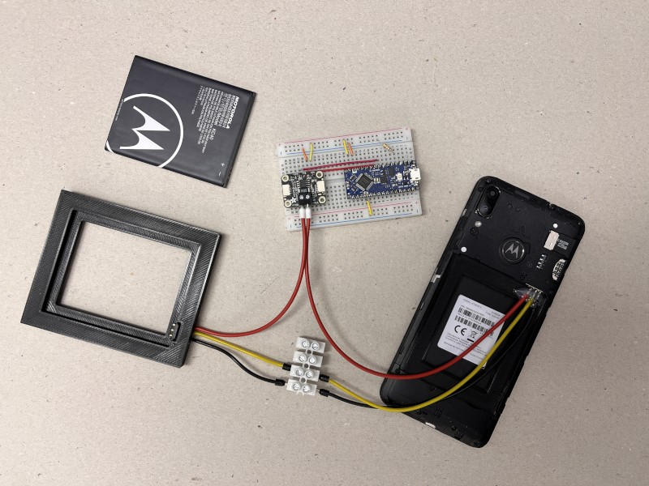

Insert the battery in the battery holder and turn on the phone.