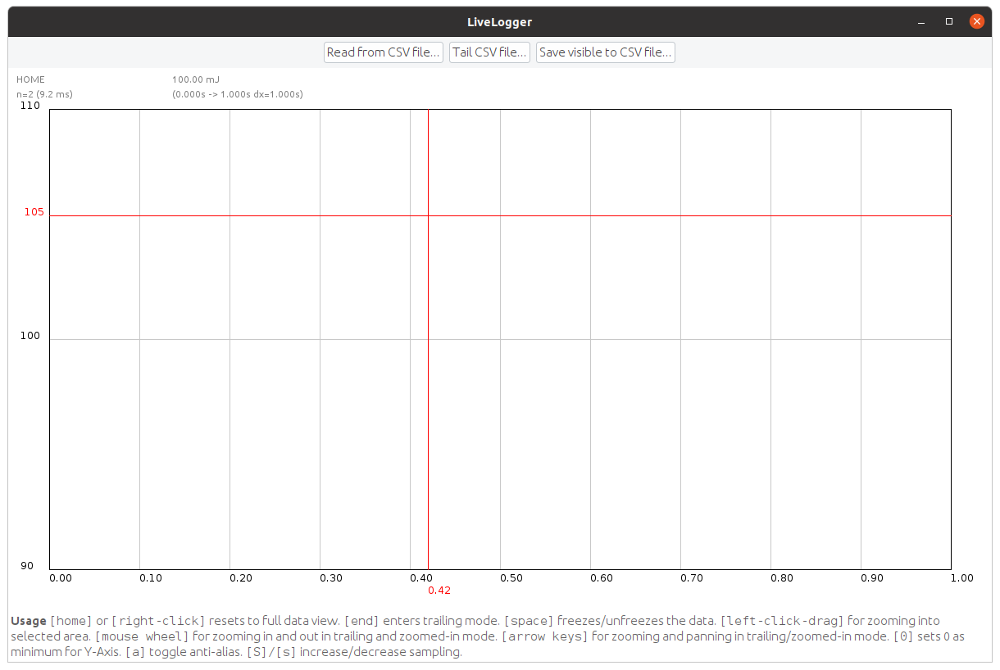
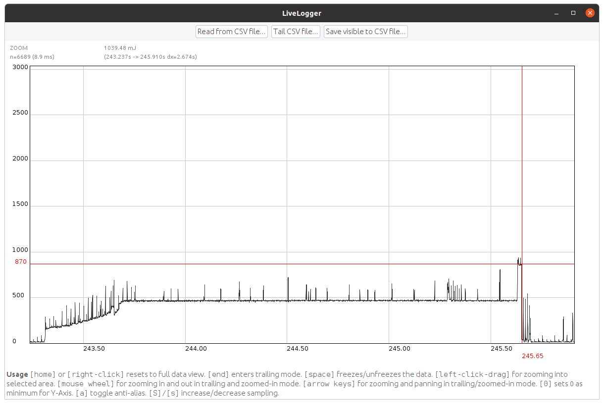
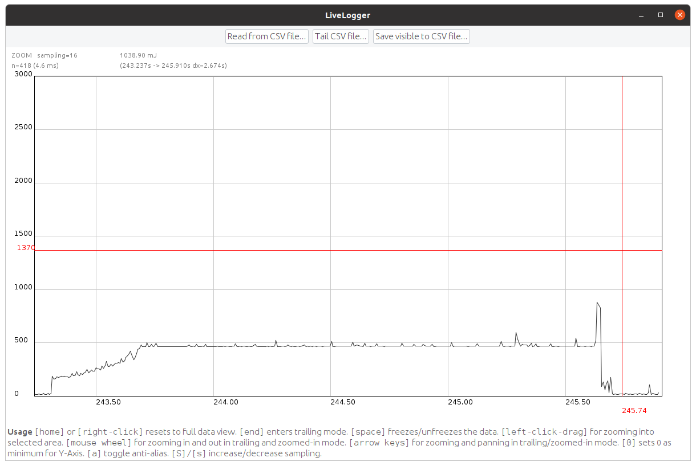

# LiveLogger

The LiveLogger is a GUI interface using Java2D which displays energy measurements.


## Setup and build

Install a JDK 8 or newer. On Ubuntu you do this by running:

```
$ sudo apt-get install openjdk-8-jdk
```

The LiveLogger builds and runs using the Gradle build tooling.
On the first execution, it will first download a recent Gradle version and all dependencies.

Execute the following command to build the live logger:

```
$ ./gradlew build
```


## Run

Execute the following command to run the live logger:

```
$ ./gradlew run
```



Once started use the you can use the top buttons to _open_ a recorded file or _tail_ a file that is currently being recorded.
The latter will follow the file like `tail -f`, i.e., continuously read data as it is being appended.

With the data you can use the mouse to select a region of interest.
The plot will then zoom into the selected region.



Pressing the `HOME` key or a right-click will reset the zoom.
You can also use the left and right arrow keys to move the zoom window.
You can zoom in and out using the mouse wheel and the up and down arrow keys.

When tailing a file you can set the zoom to automatically follow the end of the file by pressing the `END` key.
The current mode is shown in the top-left corner: `HOME`/`ZOOM`/`TAILING`.

The top also shows some basic statistics about the selected region.
Below the mode indicator you can see the number of samples of the current region and how long the draw routine takes.
To the right details about the currently displayed region are shown which include the total energy consumption and the time span.

When displaying many samples, the draw routine can take a long time.
You can improve the performance by turning-off anti-aliasing (key `a`) or increasing the sampling (`shift`+`s`).
However, when saving the currently visible region, the sampling is taken into account, i.e. the saved data will have less resolution.




## Docker

There is no Dockerfile for this component, as the GUI is not really useful in a container.
