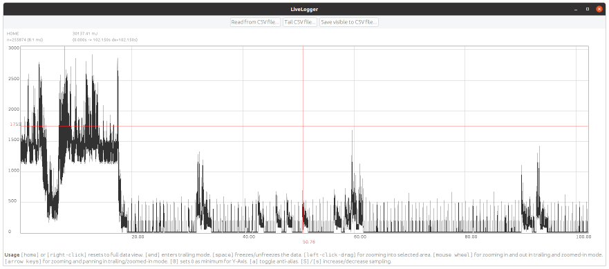
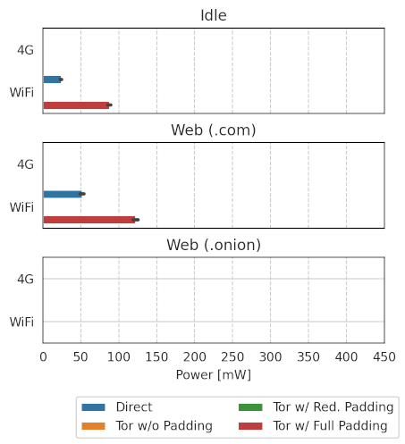

# Artifact Evaluation Walkthrough

This document walks you step-by-step through all three artifact evaluation experiments:

- **E0:** Building and testing all critical components including the hardware kit, rsoxy, and the live logger.
- **E1:** Performing a micro study to measure individual cryptographic operations
- **E2:** Performing a macro study to measure the performance of Tor vs direct website access over WiFi

The experiments provide time estimates in _human-hours_ which are the total work time, which can be interrupted, and _experiment-hours_ which are the durations of the experiments which cannot be interrupted.


## Requirements & preparations

You will need a local computer with:
- A recent Ubuntu version (we tested 20.04)
- At least 16 GiB RAM
- At least 200 GiB free disk space
- A free USB port to connect to the Arduino
- A WiFi where you can connect the smartphone and the computer to the same network

In preparation for building the individual components, you should install the following dependencies before beginning:  

- Docker; see the [Docker documentation](https://docs.docker.com/engine/install/ubuntu/)
- Rust; see the [rustup website](https://rustup.rs/)
- Python 3; it is usually preinstalled; otherwise see the Ubuntu documentation
- Android Studio; see the [Android Studio website](https://developer.android.com/studio/install)

If you use the sample traces, see [measurements/sample-traces/README.md](measurements/sample-traces/README.md) for instructions on how to extract and import them.


## E0: Building and testing all critical components (2-20 human-hours + 1×1 experiment-hour)

In this experiment you will first (optionally) build the hardware kit and then use it with the `rsoxy` and `livelogger` programs to record a test trace. This will ensure that all components are working correctly and that you are familiar with the process of recording a trace.


### E0.1: Building the hardware kit (optional: 9 human-hours, 12 hours wait time)

> **Note**
> You can skip this step if you have been provided the hardware kit or are using the sample traces.

First read the [bill of materials](hardware/bill-of-materials.md) to see what you need to build the hardware kit. Then follow the [assembly instructions](hardware/assembly-instructions.md) to build the hardware kit.

Then follow the [Arduino setup instructions](arduino/README.md) to program the Arduino.


### E0.2: Test rsoxy and live logger (1 experiment-hour)

Follow the instructions in the [rsoxy/README.md](rsoxy/README.md) to build rsoxy. 
Follow the instructions in the [livelogger/README.md](livelogger/README.md) to build livelogger. 

Connect the Arduino still to the computer, ensure that the final assembly of the hardware kit with the battery in the battery holder and the inlet inside the smartphone, and turn on the smartphone.
Start recording a test trace with `rsoxy` in `measurements/e0-test-trace.csv`.

> **Note**
> If you use the sample traces, copy the `e0/demo_trace_wifi_display_onoff_20230620_1600.csv` file to your `/measurements` directory.

The first lines of (stderr) output from `rsoxy` should look like this:

```
>> # Compiled on 'June 1 2023' at '13:37:42'
>> # mps:2897 (limit:2500)
>> # input pin: 14
>> start
```

Open the `livelogger` and tail the current measurement file. You should see the data being logged in real-time and change as you use the device. For instance, try changing the display brightness or turn the display off and observe how it enters low-power mode after a few seconds. If you are using the sample file, you should see high power consumption at the beginning (with a small dip where the brightness of the display is changed), and then lower power after the display is turned off.

The GUI should look similar to this:



If you got to here, well done! Most of the dependencies and configurations are now set up and you can proceed to the next steps. If built your own hardware kit, you can be quite confident that it is working correctly.


## E1: Micro study of cryptographic operations

In this experiment you use the most complex experiment setup to first load a scenario to the Android phone, then record it with synchronized clocks, download and combine all logs, and then re-create Table 2 from the paper.

> **Note**
> If you use the sample traces, copy the files from `e1/` file to your `/measurements` directory and skip to step E1.6.


### E1.1: Create the scenarios

The scenarios have been created for you, and you can inspect the files [scenarios/crypto_asymmetric.scenario](scenarios/crypto_asymmetric.scenario) and [scenarios/crypto_hashing.scenario](scenarios/crypto_hashing.scenario).


### E1.2: Start the webservice and upload the scenarios (1 human-hours)

Next we will build and run the webservice on the local computer. Alternatively, if could be run on a remote server, but this is more complicated and not necessary for the artifact evaluation. Follow the instructions in [webservice/README.md](webservice/README.md) to build and run the webservice. Either the local Python 3 approach or using Docker is fine.

However, verify that it is reachable from the Android phone when connected to the same WiFi. Try opening `http://<computer-wifi-ip-here>:5000/energy/android_logs.zip` in the browser on the Android phone and verify that it downloads an empty zip file.

Keep the webservice running for the rest of the experiment.

Follow the instructions in [scripts/README.md](scripts/README.md) to run the `upload_scenarios.sh` script.


### E1.3: Build and install the Android app (2 human-hour)

Follow the instructions in [android/README.md](android/README.md) to build and install the `energy_runner` Android app. For this you might need to [enable the developer mode](https://developer.android.com/studio/debug/dev-options) on the smartphone.

This is also a good time to remove or disable all unwanted apps so that they do not interfere with the experiment. Also, long press on the app, go to the app info, and disable _all_ battery optimizations. This is important to ensure that the app is not killed in the background.

Once the app is started, press the `SYNC` button to download the scenarios. They should appear in the top list. If you see an error, check the logs in the Android Studio logcat console.

Connect the USB-to-serial adapter to the USB-OTG cable and plug it into the smartphone. You should see a popup that asks you to start EnergyRunner. Confirm and select the box to always use it. Remove the adapter and force-stop the app.


### E1.4: Run the experiments (2×1 experiment-hour)

Connect the USB-to-serial adapter to the breadboard as per Step 6 in the [assembly instructions](hardware/assembly-instructions.md). Connect the USB-OTG with the adapter and the smartphone. This should now start the EnergyRunner app automatically.

Once inside the app press `SYNC` and then enter flight mode to to avoid any background network traffic. Select the scenario that you want to run first. Press `INIT USB` after which the one indicator LED on the Arduino should turn off.

On your local computer start `rsoxy` to record a file into `measurements/<scenario-name>_<yyyymmdd>_<hhmm>_raw.csv` (e.g. `measurements/crypto_asymmetric_20230620_1600_raw.csv`). The exact naming and semi-accurate datetime is important as the analysis script will use the filenames to determine which recordings belong together.

Optionally, start `livelogger` to tail the file and observe the recording as it progresses.

On the smartphone press `START` and turn off the display.

The smartphone should say "USB is connected" once it starts using the serial adapter. On the computer you should be able to observe the synchronization pattern as 1s and 0s in the stderr output of `rsoxy`.

Once the smartphone says "Sync is done", disconnect the USB-OTG cable. The smartphone should soon after confirm this by saying "USB is disconnected". The text-to-speech output is used to avoid having to turn on the screen.

Now wait patiently while the experiment is under way. Both experiments should take around 30 minutes to complete. Once the scenario is completed, the smartphone will repeatedly say "Operations finished".

Once finished, stop `rsoxy` (CTRL+C) and on the Android phone press `STOP`. Turn on WiFi and press `SYNC` to upload the Android logs to the webservice. If the upload fails, it is possible to retry multiple times as the log files are stored locally as well.

Repeat the experiment for the other scenario.


### E1.5: Download and analyze the logs (1 human-hour)

On the computer run the `analyze.py` script (see [scripts/README.md](scripts/README.md)) to download and analyze the logs. It takes the scenario filename as its mandatory command line argument.

Once finished, for every scenario name, there should be the following files in the `measurements` directory:

- `_raw.csv`: the power measurements created with `rsoxy`
- `_android.csv`: the Android logs created by the EnergyRunner app
- `_trace.csv`: additional Android logs created by the EnergyRunner app
- `_info.json`: JSON file with the clock difference information
- `_sections.csv`: the timing information and calculated energy consumption for each operations.

For the final step, the Jupyter Notebooks will only use the `_sections.csv` file, but the other files are useful for debugging and verification.


### E1.6: Run Jupyter Notebooks (1 human-hour)

Follow the instructions in [notebooks/README.md](notebooks/README.md) to run the `notebooks/jupyter_crypto_sections.ipynb` notebook. If you use your own measurements, update the filenames in the second cell.

The output of the table should look like this:

```latex
\midrule
Gen RSA-1024 & 116.47 & 76.36 \\ 
Gen RSA-2048 & 796.05 & 597.84 \\ 
Gen RSA-4096 & 2898.43 & 2042.77 \\ 
Sign RSA-1024 & 1.88 & 0.35 \\ 
Sign RSA-2048 & 6.22 & 1.22 \\ 
Sign RSA-4096 & 26.73 & 4.68 \\ 
Verify RSA-1024 & 0.34 & 0.10 \\ 
Verify RSA-2048 & 0.50 & 0.08 \\ 
Verify RSA-4096 & 0.75 & 0.10 \\ 
\midrule
Gen EC-224 & 1.11 & 0.06 \\ 
Gen EC-256 & 0.51 & 0.05 \\ 
Gen EC-384 & 2.65 & 0.07 \\ 
Gen EC-521 & 5.25 & 0.27 \\ 
Sign EC-224 & 1.43 & 0.15 \\ 
Sign EC-256 & 0.83 & 0.18 \\ 
Sign EC-384 & 3.24 & 0.16 \\ 
Sign EC-521 & 6.27 & 0.10 \\ 
Verify EC-224 & 1.52 & 0.05 \\ 
Verify EC-256 & 1.54 & 0.08 \\ 
Verify EC-384 & 3.43 & 0.07 \\ 
Verify EC-521 & 6.74 & 0.15 \\ 
\midrule
Sphinx (1x) & 9.66 & 0.31 \\ 
Sphinx (10x) & 86.34 & 8.07 \\ 
Sphinx (100x) & 842.44 & 11.40 \\ 
```


## E2: Macro study of Tor

In this experiment you measure long protocol runs and save them in individual files. In particular, you will measure the energy consumption of Orbot over WiFi for both the idle and web browsing scenarios and then compare it with not using Tor.

> **Note**
> If you use the sample traces, copy the files from `e2/` file to your `/measurements` directory and skip to step E2.4.


### E2.1: Install EnergyMetronom (1 human-hour)

Follow the instructions in [android/README.md](android/README.md) to build and install the `metronom` Android app. Afterwards, long press on the app and go to the app info. There, enable "Display over other apps" which is required to show the overlay window for the web browsing task. Also, and disable _all_ battery optimizations. This is important to ensure that the app is not killed in the background.

Test the app by selecting the settings to open the news website every 10 seconds and observe that an overlay window appears and disappears.


### E2.2: Install Orbot (1 human-hour)

Clone the [Orbot repository](https://github.com/guardianproject/orbot/) and checkout commit `b06e05c4` (version 16.6.0-RC4). Install the app following their instructions and using `./gradlew installFullpermRelease`. As this is a release build, you might need to create a signing key first (see https://developer.android.com/studio/publish/app-signing#generate-key).

Test the app on the device. In particular, enable VPN mode and verify that you can access regular websites through Tor. This can be done by opening https://check.torproject.org/ in the phone browser.

In the setting make sure to _enable_ "Connection padding" and _disable_ "Reduced connection padding". This ensures that regular connection padding is forced on. 

> **Note**
> For our experiments we have written a [patch file](android/orbot-add-setting-to-disable-connection-padding.patch) that adds a new setting to disable connection padding. This is not needed for the walkthrough, but you might want to apply it if you run your own experiments.


### E2.3: Run the experiments (4×1 experiment-hour)

Now you will run four experiments to measure the power consumption of all combinations. In the terminology of the later Jupyter notebook scripts we will have:

- `radio`:
  - `wifi`
- `activity`:
  - `idle`
  - `web`
- `networks`
  - `direct` (i.e. no Tor)
  - `fullpad` (i.e. Tor with full padding)


As you record the power consumption with `rsoxy`, make sure to name them according to this scheme: `measurements/tor_<radio>_<activity>_<network>.csv` (e.g. `measurements/tor_wifi_idle_direct.csv`). This is important as the analysis script will use the filenames to find the recordings.

As you record you can use the livelogger tool to observe the current measurements to quickly identify andy issues.

Now run the following experiments:

- `activity=idle`
  - `network=direct`
    - Turn off the display, wait 30 seconds and then record the energy measurements for at least 10 minutes.
  - `network=fullpad`
    - Enable Tor in VPN mode with the settings from above. Turn off the display, wait 30 seconds and then record the energy measurements for at least 10 minutes.
- `activity=web`
  - `network=direct`
    - Start the metronom with visiting the website every 60 seconds. Wait until it was displayed successfully one time. Then turn off the display, wait 30 seconds and then record the energy measurements for at least 10 minutes.
  - `network=fullpad`
    - Enable Tor in VPN mode with the settings from above. Start the metronom with visiting the website every 60 seconds. Wait until it was displayed successfully one time. Then turn off the display, wait 30 seconds and then record the energy measurements for at least 10 minutes.

Afterwards, you should have the following files (each around 20-25 MiB in size) in your measurements directory:

```
tor_wifi_idle_direct.csv
tor_wifi_idle_fullpad.csv
tor_wifi_web_direct.csv
tor_wifi_web_fullpad.csv
```
  
### E2.4: Analyse the measurements (1 human-hour)

Follow the instructions in [notebooks/README.md](notebooks/README.md) to run the `notebooks/jupyter_tor.ipynb` notebook.

The graph output should look like this:



And the table output should look like this:

```latex
\multicolumn{4}{c}{\textit{Idle}}\\
\midrule
4G & Direct & nan & nan\% \\ 
4G & Tor w/o Padding & nan & nan\% \\ 
4G & Tor w/ Red. Padding & nan & nan\% \\ 
4G & Tor w/ Full Padding & nan & nan\% \\ 
\midrule
WiFi & Direct & 23.4 & 0.3\% \\ 
WiFi & Tor w/o Padding & nan & nan\% \\ 
WiFi & Tor w/ Red. Padding & nan & nan\% \\ 
WiFi & Tor w/ Full Padding & 87.3 & 1.1\% \\ 
\midrule
\multicolumn{4}{c}{\textit{Web (.com)}}\\
\midrule
4G & Direct & nan & nan\% \\ 
4G & Tor w/o Padding & nan & nan\% \\ 
4G & Tor w/ Red. Padding & nan & nan\% \\ 
4G & Tor w/ Full Padding & nan & nan\% \\ 
\midrule
WiFi & Direct & 52.0 & 0.6\% \\ 
WiFi & Tor w/o Padding & nan & nan\% \\ 
WiFi & Tor w/ Red. Padding & nan & nan\% \\ 
WiFi & Tor w/ Full Padding & 122.9 & 1.5\% \\ 
\midrule
\multicolumn{4}{c}{\textit{Web (.onion)}}\\
\midrule
4G & Direct & nan & nan\% \\ 
4G & Tor w/o Padding & nan & nan\% \\ 
4G & Tor w/ Red. Padding & nan & nan\% \\ 
4G & Tor w/ Full Padding & nan & nan\% \\ 
\midrule
WiFi & Direct & nan & nan\% \\ 
WiFi & Tor w/o Padding & nan & nan\% \\ 
WiFi & Tor w/ Red. Padding & nan & nan\% \\ 
WiFi & Tor w/ Full Padding & nan & nan\% \\ 
\midrule
```

Note that some bars and entries are missing when comparing to the table. These are because we only recorded a subset of the parameter space.